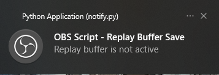

# OBS Replay Buffer Notification Script

This script uses the [OBS Scripting hooks](https://obsproject.com/wiki/Getting-Started-With-OBS-Scripting), in combination with [notify-py](https://github.com/ms7m/notify-py), to create a desktop notification when you save a replay buffer. In theory this should work on all platforms, but it has only been tested in Windows 10, and also WSL. 

This script does not change any video or streaming settings. It only adds a notification when saving the Replay Buffer.

## Install

For this script to work, one needs to install Python.

#### Windows

**Important**: For OBS 26 on Windows, you must have Python version 3.6 (see https://obsproject.com/docs/scripting.html). This line was written on 2021-05-10, and is subject to change with further releases of OBS.

1. Download the installer from: https://www.python.org/downloads/release/python-368/

2. Choose either the x64 or the x86 executable installer depending on if you're running OBS in 64 bit or in 32 bit respectively.

3. When opening the executable, click the "Install Now" option. You don't need to check any extra boxes. 
4. Open OBS, go to Tools > Scripts. Click the "Python Settings" tab at the top. The install from step 3 will have been installed in `C:\Users\<USERNAME>\AppData\Local\Programs\Python\Python36`. It is good to verify this by going into a Windows Explorer and finding this path. Browse to this path and select it in the "Python Install Path" box.

5. Download the latest release zip from the releases tab on Github: https://github.com/GiedevGils/obs-notification-script/releases
6. Extract the files from the above zip to a location of your choosing.
7. On the OBS Scripts screen, go back to the "Scripts" tab. 
8. Click on the + sign in the bottom left of the screen, and navigate to the location where you extracted the file in step 6.
9. Select the `replay-buffer-with-notification.py` file,

If you followed the above steps, the script is installed! See the [Usage](#usage) part of this ReadMe for more information.

### Linux

This was developed using WSL, and has only been tested with WSL.. 

1. Make sure that Python 3 is installed (It was tested with Python 3.8.5 on WSL)
2. Go to OBS > Tools > Scripts, then the tab Python Settings
3. Put the `/usr/bin` as Python Install Path, and this seemed to work. 
4. Download and unzip the latest [release](https://github.com/GiedevGils/obs-notification-script/releases) to a location of your choosing.
5. Go back to the "Scripts" tab, and select `replay-buffer-with-notification.py` in the unzipped location as script

If you followed the above steps, the script is installed! See the [Usage](#usage) part of this ReadMe for more information.

## Usage

This script works separately from the standard "Save Replay" keybind that is available in OBS. An additional keybind has been added, called "Save Replay with notification". 

This will perform the same functionality as the standard "Save Replay" keybind, but uses the python script to also send out a native notification.

It will look like the following: 

It will also send a notification when the keybind is pressed, and the replay buffer is not active.

It will not render the icon on MacOS, as the code used for registering the icon of the notification does not support MacOS. This might change in the future.

